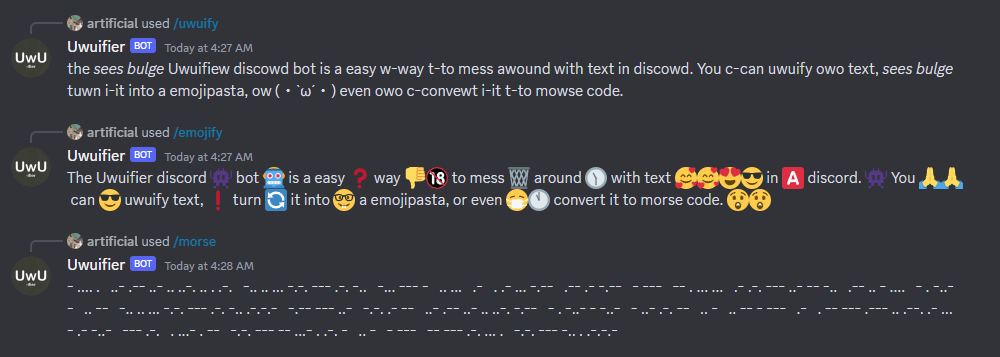

<!-- PROJECT LOGO -->
 

  <h3 align="center">Uwuifier Bot</h3>
  

  

    <a href=""><strong>Invite the bot! »</strong></a>
     
    <a href="https://github.com/artificialbutter/Uwuifier-Discord-Bot/issues">Report Bug</a>
  

<!-- TABLE OF CONTENTS -->

  
Table of Contents

  <ol>
    <li>
      <a href="#about-the-project">About The Project</a>
      <ul>
        <li><a href="#built-with">Built With</a></li>
      </ul>
    </li>
    <li><a href="#usage">Usage</a></li>
    <li><a href="#roadmap">Roadmap</a></li>
    <li><a href="#contributing">Contributing</a></li>
    <li><a href="#license">License</a></li>
  </ol>

<!-- ABOUT THE PROJECT -->
## About

I just made this so I don't have to search for songs for my friends. 

(<a href="#top">back to top</a>)

### Built With

* [discord.js](https://discord.js.org/)
* [/Create](https://www.npmjs.com/package/slash-create)
* [uwuifier](https://www.npmjs.com/package/@patarapolw/uwuifier)

<!-- USAGE EXAMPLES -->
## Usage
#### This bot's commands are accessed using discord's slash commands, which can be accessed by typing / in discord.
See Discord's <a href="https://support.discord.com/hc/en-us/articles/1500000368501-Slash-Commands-FAQ">Slash Command FAQ</a> for more info

(<a href="#top">back to top</a>)

<!-- ROADMAP -->

## Roadmap

- [] Consolidate all options into one command
- [] Think of a funny status for the bot
- [] More options

<!-- CONTRIBUTING -->
## Contributing

Contributions are what make the open source community such an amazing place to learn, inspire, and create. Any contributions you make are **greatly appreciated**.

If you have a suggestion that would make this better, please fork the repo and create a pull request. You can also simply open an issue with the tag "enhancement".

(<a href="#top">back to top</a>)

<!-- LICENSE -->
## License

Distributed under the GNU General Public License. See `LICENSE` for more information.

(<a href="#top">back to top</a>)
