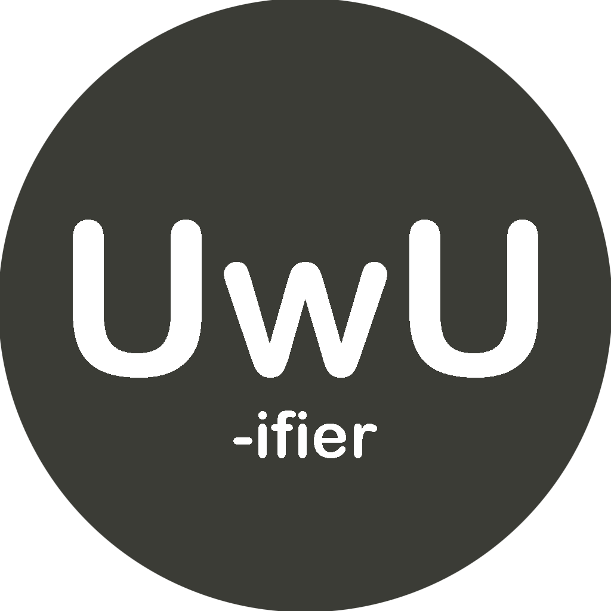

<!-- PROJECT LOGO -->
 

  

  <h3 align="center">UwUifier</h3>
  
  
  
  

    <a href="https://discord.com/api/oauth2/authorize?client_id=969743347138822174&permissions=2147801152&scope=bot%20applications.commands"><strong>Invite the bot! »</strong></a>
     
    <a href="https://github.com/artificialbutter/UwuifierBot/issues">Report Bug</a>
  

<!-- TABLE OF CONTENTS -->

  
Table of Contents

  <ol>
    <li>
      <a href="#about-the-project">About The Project</a>
      <ul>
        <li><a href="#built-with">Built With</a></li>
      </ul>
    </li>
    <li><a href="#self-hosting">Self Hosting</a></li>
    <li><a href="#contributing">Contributing</a></li>
    <li><a href="#license">License</a></li>
  </ol>

<!-- ABOUT THE PROJECT -->
## About

The Uwuifier discord bot is a easy way to mess around with text in discord.
You can uwuify text, turn it into a emojipasta, or even convert it to morse code.

### Built With

* [discord.js](https://discord.js.org/)
* [/Create](https://www.npmjs.com/package/slash-create)
* [uwuifier](https://www.npmjs.com/package/@patarapolw/uwuifier)
* [replace-word](https://www.npmjs.com/package/replace-word)

<!-- SELF HOSTING -->
## Self Hosting

### Docker (Recommended)

1. Install <a href="https://docs.docker.com/get-docker/">Docker </a>
2. Run `docker run --env=DISCORD_CLIENT_ID=BOTID --env=DISCORD_CLIENT_TOKEN=BOTTOKEN --env=DISCORD_CLIENT_PUBKEY=BOTPUBLICKEY -d ghcr.io/artificialbutter/uwuifierbot`  (replacing BOTID, BOTTOKEN, and BOTPUBLICKEY with your bot's info)

<!-- CONTRIBUTING -->
## Contributing

Contributions are what make the open source community such an amazing place to learn, inspire, and create. Any contributions you make are **greatly appreciated**.

If you have a suggestion that would make this better, please fork the repo and create a pull request. You can also simply open an issue with the tag "enhancement".

<!-- LICENSE -->
## License

Distributed under the GNU General Public License. See `LICENSE` for more information.

(<a href="#top">back to top</a>)

